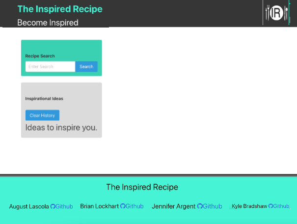

# Password Generator Automaton

## Description
Application that allows employee's to generate a random password based on the required criteria. The application runs in the browser and features dynamically updated HTML and CSS powered JavaScript code that has been refactored from provided file. Application has a clean and polished user interface that is responsive, ensuring that it adapts to multiple screen sizes.

## Table of Contents
* [Tools](#tools)
* [Links](#links)
* [Credits](#Credits)
* [User Story](#User-Story)
* [Challenge Guidelines](#challenge-guidelines)
* [Acceptance Criteria](#Acceptance-Criteria)
* [Mock Up](#Mock-Up)
* [Steps](#Steps)
* [Technical Acceptance Criteria](#Technical-Acceptance-Criteria)
* [Deployment](#Deployment)
* [Application Quality](#Application-Quality)
* [Repository Quality](#Repository-Quality)
* [Submission](#Submission)

## Tools
* HTML
* CSS
* JavaScript

## Links
### Links that Helped me along the way:
* [javascriptbook](https://javascriptbook.com/code/) 
* [W3Schools - JavaScript Arrays](https://www.w3schools.com/js/js_arrays.asp)
* [W3Schools - JavaScript Functions](https://www.w3schools.com/js/js_functions.asp)

## Credits
GitHub: [Brian Lockhart](https://github.com/bslockhart)

### User Story
AS AN employee with access to sensitive data
I WANT to randomly generate a password that meets certain criteria
SO THAT I can create a strong password that provides greater security

### Challenge Guidelines
Create an application that an employee can use to generate a random password based on criteria they’ve selected. This app will run in the browser, and will feature dynamically updated HTML and CSS powered by JavaScript code that you write. It will have a clean and polished user interface that is responsive, ensuring that it adapts to multiple screen sizes. 

### Acceptance Criteria:
* GIVEN I need a new, secure password
* WHEN I click the button to generate a password
* THEN I am presented with a series of prompts for password criteria
* WHEN prompted for password criteria
* THEN I select which criteria to include in the password
* WHEN prompted for the length of the password
* THEN I choose a length of at least 8 characters and no more than 128 characters
* WHEN asked for character types to include in the password
* THEN I confirm whether or not to include lowercase, uppercase, numeric, and/or special characters
* WHEN I answer each prompt
* THEN my input should be validated and at least one character type should be selected
* WHEN all prompts are answered
* THEN a password is generated that matches the selected criteria
* WHEN the password is generated
* THEN the password is either displayed in an alert or written to the page

## Mock Up
The following image shows the web application's appearance:

### Steps:
* Clone the starter code.
* Modify the code to meet the Acceptance Criteria.
* Ensure that your work meets the full list of grading requirements below.
* Reach out to your classmates and instructional support team for help if you need it.
* Follow the submission instructions.

### Technical Acceptance Criteria
* Satisfies all of the acceptance criteria.

### Deployment
* Application deployed at live URL.
* Application loads with no errors.
* Application GitHub URL submitted.
* GitHub repository contains application code.

### Application Quality
* Application user experience is intuitive and easy to navigate.
* Application user interface style is clean and polished.
* Application resembles the mock-up functionality provided in the Challenge instructions.

### Repository Quality
* Repository has a unique name.
* Repository follows best practices for file structure and naming conventions.
* Repository follows best practices for class/id naming conventions, indentation, quality comments, etc.
* Repository contains multiple descriptive commit messages.
* Repository contains quality readme with description, screenshot, link to deployed application.

### Submission
* Date Submitted: August 16, 2022
* The URL of the deployed application: https://bslockhart.github.io/Password-Generator-Automaton/
* The URL of the GitHub repository that contains your code: https://github.com/bslockhart/Password-Generator-Automaton
